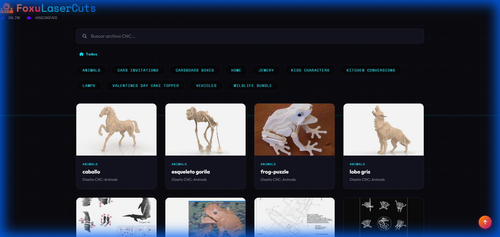
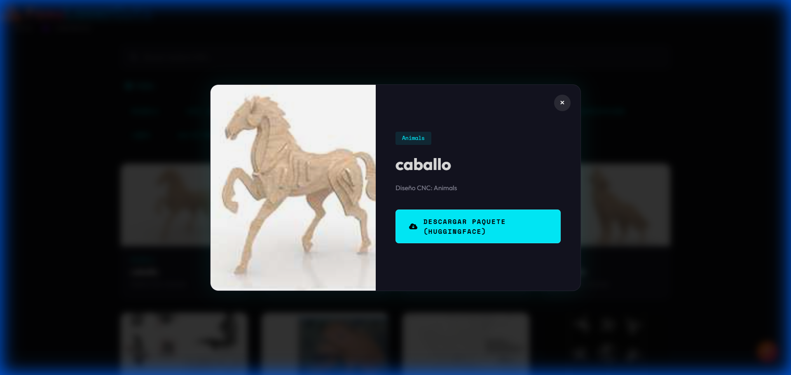

<p align="center">
  
</p>

# FoxuLaserCuts 🦊

**Visor de Catálogos CNC** - Aplicación de escritorio portable para explorar y organizar diseños de corte láser.

## ✨ Características

- 🗂️ **Navegación por Categorías** - Explora diseños por tipo
- 🔍 **Búsqueda Instantánea** - Indexado para búsquedas en tiempo real
- ⚡ **Modo Eco** - Optimización automática de GPU (F9 toggle)
- 📦 **Portable** - Un solo EXE, sin instalación
- 💾 **Smart Cache** - Sistema de caché inteligente

## 📸 Capturas

<p align="center">
  
</p>
<p align="center"><em>Vista principal del catálogo con filtros por categoría</em></p>

<p align="center">
  
</p>
<p align="center"><em>Modal de detalle con vista ampliada del diseño</em></p>

## 🚀 Descarga

Descarga la última versión desde [Releases](../../releases).

## 🛠️ Desarrollo

```powershell
# Procesar imágenes (requiere Node.js + Sharp)
npm install sharp
node ingest_sharp.js

# Compilar EXE portable
powershell -ExecutionPolicy Bypass -File Build_EXE.ps1

# Servidor de desarrollo
npx http-server -p 8080 -o
```

## 📊 Stack Técnico

- Frontend: HTML5, CSS3, JavaScript Vanilla
- Imágenes: AVIF (Sharp)
- Empaquetado: C# Self-Extractor

## 📝 Licencia

MIT

---

*🦊 FoxuLabs*
